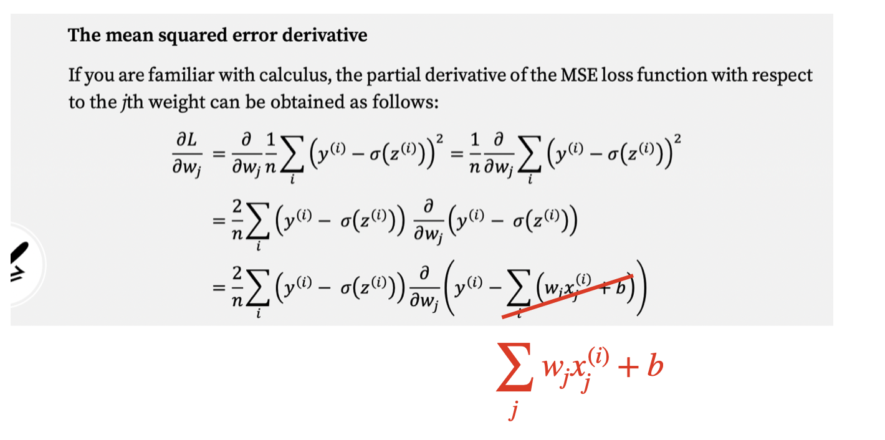
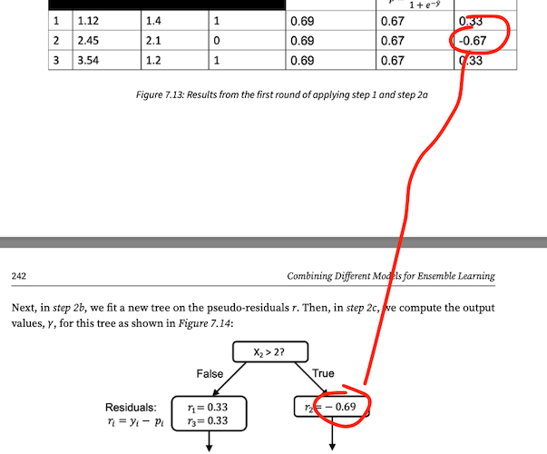

# *Machine Learning with PyTorch and Scikit-Learn* Book

##  Errata


### Chapter 2


**Page 23**

- It seems that the predicted label ŷ and the true label y got flipped.

**Page 24**

> It is important to note that the convergence of the perceptron is only guaranteed if the two classes are linearly separable, which means that the two classes cannot be perfectly separated by a linear decision boundary. 

- Linearly separable means that the two classes ***can*** be perfectly separated (it mistakenly said "cannot"). [[#10](https://github.com/rasbt/machine-learning-book/issues/10)]

**Page 37**

For context: 

> The mean squared error loss is shown with an added 1/2 term which, in the text, is called out as a convenience term used to make deriving the gradient easier. It seems like use of this term is completely dropped / ignored in all later uses of this loss function.

I remember that I was thinking about whether I should use the convenience term or not. I thought I cleaned this up, but it now looks like a weird hybrid where I introduce the convenience term but then don't use it.

**Page 38**

In the MSE derivative, there is a spot where the summation is over *i* but it should be over *j*:



### Chapter 3

It should be *logical_xor* instead of *logical_or* in the text.

**Page 60**

The correct link is: https://www.youtube.com/watch?v=L0FU8NFpx4E instead of  https://www.youtube.com/L0FU8NFpx4E.


### Chapter 6

**Page 185**

The text says

> In this case, the sweet spot appears to be between 0.01 and 0.1 of the C value.

but "between 0.1 and 1.0" would have been more accurate. [[#27](https://github.com/rasbt/machine-learning-book/issues/27)]


**Page 188**

The following import is missing:

    >>> import scipy.stats

**Page 200**

It says "[...] via the `interp` function that we imported from SciPy" but we imported it from NumPy not SciPy.  [[#199](https://github.com/rasbt/machine-learning-book/issues/199)]


### Chapter 7

**Page 232**

We have

```python
>>> update_if_wrong_2 = 0.1 * np.exp(-alpha_j * 1 * -1)
>>> print(update_if_wrong_2)
0.1527525231651947
```

but that looks exactly like the formula for `update_if_wrong_1`. The result is the same, but it would be more clear to change it to the following:

```python
>>> update_if_wrong_2 = 0.1 * np.exp(-alpha_j * -1 * 1)
>>> print(update_if_wrong_2)
0.1527525231651947
```

### Chapter 9

**Page 287**

Here, the mean absolute deviation was computed

```python
>>> def mean_absolute_deviation(data):
... return np.mean(np.abs(data - np.mean(data))) 
>>> mean_absolute_deviation(y)
58269.561754979375
```

But it makes more sense to compute the median absolute deviation

```python
>>> def median_absolute_deviation(data):
... return np.median(np.abs(data - np.median(data))) 
>>> median_absolute_deviation(y)
37000.00
```

### Chapter 7

**Page 242**

The value -0.69 should be -0.67 as shown in the annotated screenshot below:




### Chapter 9

**Page 291**

In original text of the first paragraph in  p. 291

> We can see that the MSE on the training dataset is **larger**  than on the test set, which is an indicator that our model is slightly overfitting the training data in this case. 

should be corrected as follows:

> We can see that the MSE on the training dataset is **less**  than on the test set, which is an indicator that our model is slightly overfitting the training data in this case.

**Page 292**

Not an error, but in the proof showing that the $$R^2$$ is a rescaled version of the MSE,

$$
\begin{align*}
R^2 
&= 1 - \frac{SSE}{SST} \\
&= 1 - \frac{ \frac{1}{n} \sum_{i=1}^{n} \big ( y^{(i)} - \hat{y}^{(i)} \big )^{2} }
        { \frac{1}{n} \sum_{i=1}^{n} \big ( y^{(i)} - \mu_{y} \big )^{2} } \\
&= 1 - \frac{MSE}{Var(y)}
\end{align*}
$$

it might be good to insert 

$$
= 1 - \frac{\frac{1}{n}SSE}{\frac{1}{n}SST}
$$

after the first line to make it easier to follow.

### Chapter 11

**Page 34:**

The code comments for the `NeuralNetMLP`'s are outdated [[#23](https://github.com/rasbt/machine-learning-book/issues/23)]. Originally, I implemented the following computation

```python
z_h = np.dot(x, self.weight_h.T) + self.bias_h
```

via the equivalent 

```python
z_h = np.dot(self.weight_h, x.T).T + self.bias_h
```

(Note that in both cases `z_h` is exactly the same.)


The code comments reflect the second code line. For the first line, the code comment has to change and should be

```python
# input dim: [n_examples, n_features] dot [n_hidden, n_features].T
# output dim: [n_examples, n_hidden]
z_h = np.dot(x, self.weight_h.T) + self.bias_h
```

Similarly, the code comments for `z_out` should be 

```python
# input dim: [n_examples, n_hidden] dot [n_classes, n_hidden].T
# output dim: [n_examples, n_classes]
z_out = np.dot(a_h, self.weight_out.T) + self.bias_out
```


**Page 366**

There are two duplication errors on the page as shown in the figure below:


### Chapter 12

**Page 380**

> We can also simply utilize the torch.utils.data.TensorDataset class, if the second dataset is a labeled dataset in the form of tensors. So, instead of using our self-defined Dataset class, JointDataset, we can create a joint dataset as follows:
>
> **>>>** joint_dataset = JointDataset(t_x, t_y)

- Here, we mistakenly used `JointDataset` again. It should have been

```python
from torch.utils.data import TensorDataset
joint_dataset = TensorDataset(t_x, t_y)
```

**Page 391**

On some computers, it is necessary to cast the tensor to a float tensor explicitely, that is, changing

```python
y_train = torch.from_numpy(y_train)
```

to 

```python
y_train = torch.from_numpy(y_train).float()
```


**Page 392**

To be more explicit and to improve compatibility with certain computing environment, the line 

```python
loss = loss_fn(pred, y_batch)
```

should be changed to

```python
loss = loss_fn(pred, y_batch.long())
```


**Page 396**

I was 99% sure I fixed that during editing, but on page 396, the `Model` has a `x = nn.Softmax(dim=1)(x)` layer that shouldn't be there.

**Page 397**

In the line 

```python
accuracy_hist[epoch] += is_correct.mean()
```

it should be `is_correct.sum()` instead of `is_correct.mean()`. The resulting figures etc. are all correct, though.


**Page 400**

The word "multilabel" should be "multiclass". [[#35](https://github.com/rasbt/machine-learning-book/issues/35)]


### Chapter 13

**Page 422**

In the lines

```python
... loss_hist_train[epoch] /= n_train
... accuracy_hist_train[epoch] /= n_train/batch_size
```

The first line misses the `/batch_size`.


**Page 429**

On page, we 419 defined the number of training examples as `n_train = 100`. On page 429 we then write 

```python
loss_hist_train[epoch] /= 100/batch_size
accuracy_hist_train[epoch] /= 100/batch_size
```

It is technically not a mistake, but some readers may wonder where the `100/` comes from, so it might be clearer to write it as follows:

```python
loss_hist_train[epoch] /= n_train/batch_size
accuracy_hist_train[epoch] /= n_train/
```


### Chapter 14

**Page 472**

In the figure, the `y_pred` value for the `BCELoss` is 0.8, but it should be 0.69, because of sigmoid(0.8) = 0.69. You can find an updated figure [here](../ch14/figures/14_11.png).

Also, in the lines 

```python
... f'{cce_logits_loss_fn(logits, target):.4f}') CCE (w Probas): 0.5996
>>> print(f'CCE (w Logits): '
... f'{cce_loss_fn(torch.log(probas), target):.4f}') CCE (w Logits): 0.5996
```

the phrases `w Probas` and `w Logits` should be flipped.  [[#34](https://github.com/rasbt/machine-learning-book/issues/34)]


### Chapter 15

**Page 483**

Not an errata, but it would be good to clarify in the infobox that users have to unzip the `img_align_celeba.zip` file, which is inside the unzipped `celeba` folder.


**Page 488**

The correct smile attribute is not `attr[18]` but `attr[31]`. Consequently, the plot on pg. 495 will look a bit different. The test accuracy on pg. 496 will be around 90.21%. And the pictures on pg. 497 will look a bit different. The [ch14_part2.ipynb](../ch14/ch14_part2.ipynb) Jupyter notebook in this GitHub repository was updated accordingly :).


**Page 508**

In the following line

    ht = torch.matmul(xt, torch.transpose(w_xh, 0, 1)) + b_hh

the bias should be  `b_xh` instead of `b_hh`. However, the resulting output is correct.


**Page 519**

There is a sentence that says "Therefore, the embedding matrix in this case has the size 10×6." However, as it can be seen from the code, it should be "10×3" not "10×6". [[#36](https://github.com/rasbt/machine-learning-book/issues/36)]

**Page 530**

It would not make any difference because of the newline characters at the end, but to be technically correct, we should add a `+1` to the `chunk_size` in

```python
>>> text_chunks = [text_encoded[i:i+chunk_size]
... for i in range(len(text_encoded)-chunk_size)]
```

I.e.,

```python
>>> text_chunks = [text_encoded[i:i+chunk_size]
... for i in range(len(text_encoded)-chunk_size+1)]
```

(Via [[#38](https://github.com/rasbt/machine-learning-book/issues/38)].)


**Page 532**

`LogSoftmax(dim=1)` is not used when defining the model -- this is correct, because `nn.CrossEntropyLoss` is designed for logits, not log-probabilities. However, the output contains a false reference to `LogSoftmax(dim=1)` (this is a left-over from editing, and it can be ignored).  [[#37](https://github.com/rasbt/machine-learning-book/issues/37)]


**Page 532**

The learning rate (`lr=0.001`) is too low here. If we change it to `lr=0.005` we can get much better results.
