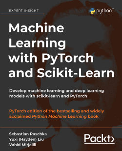

# *Machine Learning with PyTorch and Scikit-Learn* Book

##  Code Repository

Paperback: 770 pages  
Publisher: Packt Publishing  
Language: English

ISBN-10: 1801819319   
ISBN-13: 978-1801819312  
Kindle ASIN: B09NW48MR1  

## Links

- [Amazon link](https://www.amazon.com/Machine-Learning-PyTorch-Scikit-Learn-scikit-learn-ebook-dp-B09NW48MR1/dp/B09NW48MR1/) 
- [Packt link](https://www.packtpub.com/product/machine-learning-with-pytorch-and-scikit-learn/9781801819312)
- [Blog post summarizing the contents](https://sebastianraschka.com/blog/2022/ml-pytorch-book.html)

## Table of Contents and Code Notebooks

**Helpful installation and setup instructions can be found in the [README.md file of Chapter 1](ch01/README.md)**

**Please note that these are just the code examples accompanying the book, which we uploaded for your convenience; be aware that these notebooks may not be useful without the formulae and descriptive text.**   

1. Machine Learning - Giving Computers the Ability to Learn from Data [[open dir](ch01)] 
2. Training Machine Learning Algorithms for Classification [[open dir](ch02)] 
3. A Tour of Machine Learning Classifiers Using Scikit-Learn [[open dir](ch03)] 
4. Building Good Training Sets – Data Pre-Processing [[open dir](ch04)] 
5. Compressing Data via Dimensionality Reduction [[open dir](ch05)] 
6. Learning Best Practices for Model Evaluation and Hyperparameter Optimization [[open dir](ch06)]
7. Combining Different Models for Ensemble Learning [[open dir](ch07)] 
8. Applying Machine Learning to Sentiment Analysis  [[open dir](ch08)]  
9. Predicting Continuous Target Variables with Regression Analysis [[open dir](ch09)] 
10. Working with Unlabeled Data – Clustering Analysis [[open dir](ch10)] 
11. Implementing a Multi-layer Artificial Neural Network from Scratch [[open dir](ch11)] 
12. Parallelizing Neural Network Training with PyTorch [[open dir](ch12)] 
13. Going Deeper -- The Mechanics of PyTorch [[open dir](ch13)] 
14. Classifying Images with Deep Convolutional Neural Networks [[open dir](ch14)]  
15. Modeling Sequential Data Using Recurrent Neural Networks [[open dir](ch15)]  
16. Transformers -- Improving Natural Language Processing with Attention Mechanisms [[open dir](ch16)]  
17. Generative Adversarial Networks for Synthesizing New Data [[open dir](ch17)]   
18. Graph Neural Networks for Capturing Dependencies in Graph Structured Data [[open dir](ch18)]  
19. Reinforcement Learning for Decision Making in Complex Environments [[open dir](ch19)] 

---

 
 

Sebastian Raschka, Yuxi (Hayden) Liu, and Vahid Mirjalili. *Machine Learning with PyTorch and Scikit-Learn*. Packt Publishing, 2022.

    @book{mlbook2022,  
    address = {Birmingham, UK},  
    author = {Sebastian Raschka, and Yuxi (Hayden) Liu, and Vahid Mirjalili},  
    isbn = {978-1801819312},   
    publisher = {Packt Publishing},  
    title = {{Machine Learning with PyTorch and Scikit-Learn}},  
    year = {2022}  
    }
    
    
## Translations into other Languages

- Serbian Translation: [Mašinsko učenje uz PyTorch i Scikit-Learn](https://knjige.kombib.rs/masinsko-ucenje-uz-pytorch-i-scikit-learn).
ISBN: 9788673105772
